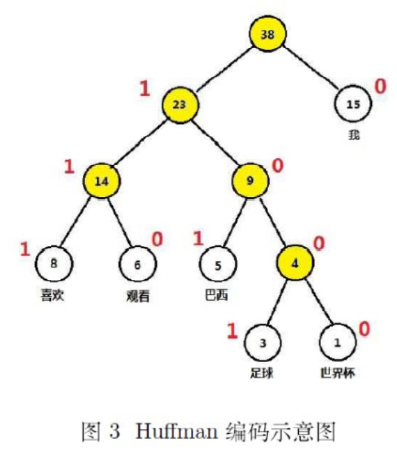

Huffman树(最优二叉树): 带权路径长度最小的树

<!-- more -->
# Huffman
前置知识:
1. 二叉树
2. 路径/路径长度/带权路径长度

## 构造Huffman树
> 二叉树叶子结点权重为{w1, ..., wn}, 构造一棵Huffman树

1. {w1, ..., wn}构造n棵树的森林
2. 森林中选权值最小2树合并, root权值为2权值和
3. 森林删除该2树, 将新root放回森林
4. 重复2,3直到只剩1棵树

## 应用
- 一般用于数据通信, 优化编码.
- 权值一般用**词频**, 高频词用短码(不等长编码/前缀编码)(权值大的接近root), 从而使传输报文长度缩短
- 前缀编码: 一个词不能是另一个词的前缀
- Huffman树左1右0刚好就可以给每个叶子(词)进行不等长编码

> 一般规定
> - 权值大的在左子树
> - 编码左1右0
